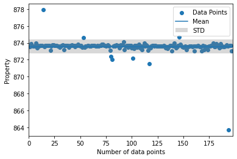
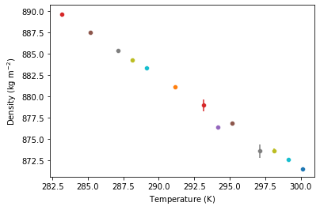

.. code:: ipython3

    import gro_exp
    import numpy as np
    import matplotlib.pyplot as plt
    import pandas as pd

Example Notebook for pyDB
=========================

Read the density data from two components from a DDB Data Excel File
over a specified temperature area for a pressure of 1 bar

.. code:: ipython3

    # Set the tempature area
    temp_vec = np.linspace(280.15,300.15,21)

    # Read the data with the following function
    data, prop_dict = gro_exp.ddb.read_exp_temp_vec("data/benzene_exp_density.xls", temp_vec, "DEN", press=101325.000, p_nan=False, is_plot=True, is_display=False)

.. image:: pics/output_2_0.png

The data dictionary contains the Mean properties, standard deviation and
number of data points at the specified temperatures. The prop_dict
dictonary contains the data points which are used to calculate the mean
values at the specified temperature. In the following cell shows some
content for these dictonarys

.. code:: ipython3

    # Define the temperature which you would like consider
    temp = 288.15

    # Data frames
    df_mean = pd.DataFrame(data)
    df_prop_295 = pd.DataFrame(prop_dict[str(temp)], columns=["Density (T=" + str(temp) + "K)"])

    # Display the data frames
    display(df_mean)
    display(df_prop_295)

.. raw:: html

    

    
    <table border="1" class="dataframe">
      <thead>
        <tr style="text-align: right;">
          <th></th>
          <th>Temperature (K)</th>
          <th>DEN (kg/m3)</th>
          <th>STD (kg/m3)</th>
          <th>Number of data points</th>
        </tr>
      </thead>
      <tbody>
        <tr>
          <th>0</th>
          <td>280.15</td>
          <td>NaN</td>
          <td>NaN</td>
          <td>NaN</td>
        </tr>
        <tr>
          <th>1</th>
          <td>281.15</td>
          <td>NaN</td>
          <td>NaN</td>
          <td>NaN</td>
        </tr>
        <tr>
          <th>2</th>
          <td>282.15</td>
          <td>NaN</td>
          <td>NaN</td>
          <td>NaN</td>
        </tr>
        <tr>
          <th>3</th>
          <td>283.15</td>
          <td>889.606250</td>
          <td>0.208877</td>
          <td>12.0</td>
        </tr>
        <tr>
          <th>4</th>
          <td>284.15</td>
          <td>NaN</td>
          <td>NaN</td>
          <td>NaN</td>
        </tr>
        <tr>
          <th>5</th>
          <td>285.15</td>
          <td>887.500000</td>
          <td>0.000000</td>
          <td>1.0</td>
        </tr>
        <tr>
          <th>6</th>
          <td>286.15</td>
          <td>NaN</td>
          <td>NaN</td>
          <td>NaN</td>
        </tr>
        <tr>
          <th>7</th>
          <td>287.15</td>
          <td>885.400000</td>
          <td>0.000000</td>
          <td>1.0</td>
        </tr>
        <tr>
          <th>8</th>
          <td>288.15</td>
          <td>884.275056</td>
          <td>0.154745</td>
          <td>18.0</td>
        </tr>
        <tr>
          <th>9</th>
          <td>289.15</td>
          <td>883.340000</td>
          <td>0.140000</td>
          <td>2.0</td>
        </tr>
        <tr>
          <th>10</th>
          <td>290.15</td>
          <td>NaN</td>
          <td>NaN</td>
          <td>NaN</td>
        </tr>
        <tr>
          <th>11</th>
          <td>291.15</td>
          <td>881.100000</td>
          <td>0.000000</td>
          <td>1.0</td>
        </tr>
        <tr>
          <th>12</th>
          <td>292.15</td>
          <td>NaN</td>
          <td>NaN</td>
          <td>NaN</td>
        </tr>
        <tr>
          <th>13</th>
          <td>293.15</td>
          <td>878.951217</td>
          <td>0.657108</td>
          <td>69.0</td>
        </tr>
        <tr>
          <th>14</th>
          <td>294.15</td>
          <td>876.400000</td>
          <td>0.000000</td>
          <td>1.0</td>
        </tr>
        <tr>
          <th>15</th>
          <td>295.15</td>
          <td>876.900000</td>
          <td>0.000000</td>
          <td>1.0</td>
        </tr>
        <tr>
          <th>16</th>
          <td>296.15</td>
          <td>NaN</td>
          <td>NaN</td>
          <td>NaN</td>
        </tr>
        <tr>
          <th>17</th>
          <td>297.15</td>
          <td>873.600000</td>
          <td>0.778888</td>
          <td>3.0</td>
        </tr>
        <tr>
          <th>18</th>
          <td>298.15</td>
          <td>873.548792</td>
          <td>0.825668</td>
          <td>197.0</td>
        </tr>
        <tr>
          <th>19</th>
          <td>299.15</td>
          <td>872.600000</td>
          <td>0.000000</td>
          <td>1.0</td>
        </tr>
        <tr>
          <th>20</th>
          <td>300.15</td>
          <td>871.500000</td>
          <td>0.000000</td>
          <td>1.0</td>
        </tr>
      </tbody>
    </table>
    

.. raw:: html

    

    
    <table border="1" class="dataframe">
      <thead>
        <tr style="text-align: right;">
          <th></th>
          <th>Density (T=288.15K)</th>
        </tr>
      </thead>
      <tbody>
        <tr>
          <th>0</th>
          <td>884.200</td>
        </tr>
        <tr>
          <th>1</th>
          <td>884.380</td>
        </tr>
        <tr>
          <th>2</th>
          <td>884.300</td>
        </tr>
        <tr>
          <th>3</th>
          <td>884.267</td>
        </tr>
        <tr>
          <th>4</th>
          <td>884.000</td>
        </tr>
        <tr>
          <th>5</th>
          <td>884.110</td>
        </tr>
        <tr>
          <th>6</th>
          <td>884.134</td>
        </tr>
        <tr>
          <th>7</th>
          <td>884.250</td>
        </tr>
        <tr>
          <th>8</th>
          <td>884.476</td>
        </tr>
        <tr>
          <th>9</th>
          <td>884.340</td>
        </tr>
        <tr>
          <th>10</th>
          <td>884.411</td>
        </tr>
        <tr>
          <th>11</th>
          <td>884.100</td>
        </tr>
        <tr>
          <th>12</th>
          <td>884.300</td>
        </tr>
        <tr>
          <th>13</th>
          <td>884.200</td>
        </tr>
        <tr>
          <th>14</th>
          <td>884.183</td>
        </tr>
        <tr>
          <th>15</th>
          <td>884.300</td>
        </tr>
        <tr>
          <th>16</th>
          <td>884.300</td>
        </tr>
        <tr>
          <th>17</th>
          <td>884.700</td>
        </tr>
      </tbody>
    </table>
    

It is possible to plot the data points at a temperature to see the
outliers

.. code:: ipython3

    gro_exp.ddb.plot_data(prop_dict,temp)
    plt.ylim([800,900])

.. parsed-literal::

    (800.0, 900.0)

If you specified the outliers you can drop these and calculate a new
data dictonary

.. code:: ipython3

    df_mean = pd.DataFrame(data)
    data = gro_exp.ddb.drop_outliers(data,prop_dict,temp, [810,820])
    display(df_mean)

.. parsed-literal::

    /Library/Frameworks/Python.framework/Versions/3.9/lib/python3.9/site-packages/numpy/core/fromnumeric.py:3474: RuntimeWarning: Mean of empty slice.
      return _methods._mean(a, axis=axis, dtype=dtype,
    /Library/Frameworks/Python.framework/Versions/3.9/lib/python3.9/site-packages/numpy/core/_methods.py:189: RuntimeWarning: invalid value encountered in double_scalars
      ret = ret.dtype.type(ret / rcount)
    /Library/Frameworks/Python.framework/Versions/3.9/lib/python3.9/site-packages/numpy/core/_methods.py:264: RuntimeWarning: Degrees of freedom <= 0 for slice
      ret = _var(a, axis=axis, dtype=dtype, out=out, ddof=ddof,
    /Library/Frameworks/Python.framework/Versions/3.9/lib/python3.9/site-packages/numpy/core/_methods.py:222: RuntimeWarning: invalid value encountered in true_divide
      arrmean = um.true_divide(arrmean, div, out=arrmean, casting='unsafe',
    /Library/Frameworks/Python.framework/Versions/3.9/lib/python3.9/site-packages/numpy/core/_methods.py:256: RuntimeWarning: invalid value encountered in double_scalars
      ret = ret.dtype.type(ret / rcount)

.. raw:: html

    

    
    <table border="1" class="dataframe">
      <thead>
        <tr style="text-align: right;">
          <th></th>
          <th>Temperature (K)</th>
          <th>DEN (kg/m3)</th>
          <th>STD (kg/m3)</th>
          <th>Number of data points</th>
        </tr>
      </thead>
      <tbody>
        <tr>
          <th>0</th>
          <td>280.15</td>
          <td>NaN</td>
          <td>NaN</td>
          <td>NaN</td>
        </tr>
        <tr>
          <th>1</th>
          <td>281.15</td>
          <td>NaN</td>
          <td>NaN</td>
          <td>NaN</td>
        </tr>
        <tr>
          <th>2</th>
          <td>282.15</td>
          <td>NaN</td>
          <td>NaN</td>
          <td>NaN</td>
        </tr>
        <tr>
          <th>3</th>
          <td>283.15</td>
          <td>889.606250</td>
          <td>0.208877</td>
          <td>12.0</td>
        </tr>
        <tr>
          <th>4</th>
          <td>284.15</td>
          <td>NaN</td>
          <td>NaN</td>
          <td>NaN</td>
        </tr>
        <tr>
          <th>5</th>
          <td>285.15</td>
          <td>887.500000</td>
          <td>0.000000</td>
          <td>1.0</td>
        </tr>
        <tr>
          <th>6</th>
          <td>286.15</td>
          <td>NaN</td>
          <td>NaN</td>
          <td>NaN</td>
        </tr>
        <tr>
          <th>7</th>
          <td>287.15</td>
          <td>885.400000</td>
          <td>0.000000</td>
          <td>1.0</td>
        </tr>
        <tr>
          <th>8</th>
          <td>288.15</td>
          <td>884.275056</td>
          <td>0.154745</td>
          <td>18.0</td>
        </tr>
        <tr>
          <th>9</th>
          <td>289.15</td>
          <td>883.340000</td>
          <td>0.140000</td>
          <td>2.0</td>
        </tr>
        <tr>
          <th>10</th>
          <td>290.15</td>
          <td>NaN</td>
          <td>NaN</td>
          <td>NaN</td>
        </tr>
        <tr>
          <th>11</th>
          <td>291.15</td>
          <td>881.100000</td>
          <td>0.000000</td>
          <td>1.0</td>
        </tr>
        <tr>
          <th>12</th>
          <td>292.15</td>
          <td>NaN</td>
          <td>NaN</td>
          <td>NaN</td>
        </tr>
        <tr>
          <th>13</th>
          <td>293.15</td>
          <td>878.951217</td>
          <td>0.657108</td>
          <td>69.0</td>
        </tr>
        <tr>
          <th>14</th>
          <td>294.15</td>
          <td>876.400000</td>
          <td>0.000000</td>
          <td>1.0</td>
        </tr>
        <tr>
          <th>15</th>
          <td>295.15</td>
          <td>876.900000</td>
          <td>0.000000</td>
          <td>1.0</td>
        </tr>
        <tr>
          <th>16</th>
          <td>296.15</td>
          <td>NaN</td>
          <td>NaN</td>
          <td>NaN</td>
        </tr>
        <tr>
          <th>17</th>
          <td>297.15</td>
          <td>873.600000</td>
          <td>0.778888</td>
          <td>3.0</td>
        </tr>
        <tr>
          <th>18</th>
          <td>298.15</td>
          <td>873.548792</td>
          <td>0.825668</td>
          <td>197.0</td>
        </tr>
        <tr>
          <th>19</th>
          <td>299.15</td>
          <td>872.600000</td>
          <td>0.000000</td>
          <td>1.0</td>
        </tr>
        <tr>
          <th>20</th>
          <td>300.15</td>
          <td>871.500000</td>
          <td>0.000000</td>
          <td>1.0</td>
        </tr>
      </tbody>
    </table>
    

Now you can plot and display the new mean values after the adjustment

.. code:: ipython3

    gro_exp.ddb.plot_means(data)

After all you can save the data in a obj file and reload at and plot it
again

.. code:: ipython3

    gro_exp.utils.save_data("test.obj",data)
    data = gro_exp.utils.load_data("test.obj")
